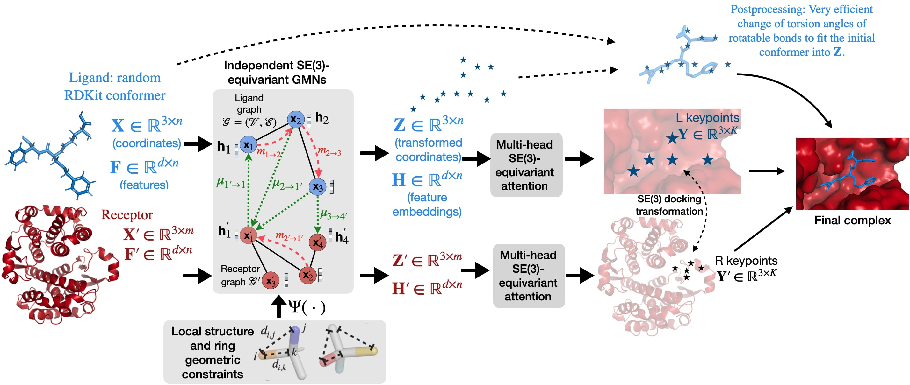

# EquiBind: Geometric Deep Learning for Drug Binding Structure Prediction

### [Paper on arXiv](https://arxiv.org/abs/2202.05146)

EquiBind, is a
SE(3)-equivariant geometric deep learning model
performing direct-shot prediction of both i) the receptor binding location (blind docking) and ii) the
ligand’s bound pose and orientation. EquiBind
achieves significant speed-ups and better quality
compared to traditional and recent baselines.
 If you have questions, don't hesitate to open an issue or ask me
via [hannes.staerk@tum.de](hannes.staerk@tum.de)
or [social media](https://hannes-stark.com/) or Octavian Ganea via [oct@mit.edu](oct@mit.edu). We are happy to hear from you!




# Dataset

Our preprocessed data (see dataset section in the paper Appendix) is available from [zenodo](https://zenodo.org/record/6034088). \
The files in `data` contain the names for the time-based data split.

If you want to train one of our models with the data then: 
1. download it from [zenodo](https://zenodo.org/record/6034088) 
2. unzip the directory and place it into `data` such that you have the path `data/PDBBind`


# Use provided model weights to predict binding structure of your own protein-ligand pairs:

## Step 1: What you need as input

Ligand files of the formats ``.mol2`` or ``.sdf`` or ``.pdbqt`` or ``.pdb``. \
Receptor files of the format ``.pdb`` \
For each complex you want to predict you need a directory containing the ligand and receptor file. Like this: 
```
my_data_folder
└───name1
    │   name1_protein.pdb
    │   name1_ligand.sdf
└───name2
    │   name2_protein.pdb
    │   name2_ligand.sdf
...
```

## Step 2: Setup Environment

We will set up the environment using [Anaconda](https://docs.anaconda.com/anaconda/install/index.html). Clone the
current repo

    git clone https://github.com/HannesStark/EquiBind

Create a new environment with all required packages using `environment.yml` (this can take a while). While in the project directory run:

    conda env create

Activate the environment

    conda activate equibind

Here are the requirements themselves if you want to install them manually instead of using the `environment.yml`:
````
python=3.7
pytorch 1.10
torchvision
cudatoolkit=10.2
torchaudio
dgl-cuda10.2
rdkit
openbabel
biopython
rdkit
biopandas
pot
dgllife
joblib
pyaml
icecream
matplotlib
tensorboard
````

## Step 3: Predict Binding Structures!

In the config file `configs_clean/inference.yml` set the path to your input data folder `inference_path: path_to/my_data_folder`.  
Then run:

    python inference.py --config=configs_clean/inference.yml

Done! :tada: \
Your results are saved as `.sdf` files in the directory specified
in the config file under ``output_directory: 'data/results/output'`` and as tensors at ``runs/flexible_self_docking/predictions_RDKitFalse.pt``!

# Reproducing paper numbers
Download the data and place it as described in the "Dataset" section above.
### Using the provided model weights
To predict binding structures using the provided model weights run: 

    python inference.py --config=configs_clean/inference_file_for_reproduce.yml

This will give you the results of *EquiBind-U* and then those of *EquiBind* after running the fast ligand point cloud fitting corrections. \
The numbers are a bit better than what is reported in the paper. We will put the improved numbers into the next update of the paper.
### Training a model yourself and using those weights
To train the model yourself, run:

    python train.py --config=configs_clean/RDKitCoords_flexible_self_docking.yml

The model weights are saved in the `runs` directory.\
You can also start a tensorboard server ``tensorboard --logdir=runs`` and watch the model train. \
To evaluate the model on the test set, change the ``run_dirs:`` entry of the config file `inference_file_for_reproduce.yml` to point to the directory produced in `runs`.
Then you can run``python inference.py --config=configs_clean/inference_file_for_reproduce.yml`` as above!
## Reference 

:page_with_curl: Paper [on arXiv](https://arxiv.org/abs/2202.05146)
```
@misc{stark2022equibind,
      title={EquiBind: Geometric Deep Learning for Drug Binding Structure Prediction}, 
      author={Hannes Stärk and Octavian-Eugen Ganea and Lagnajit Pattanaik and Regina Barzilay and Tommi Jaakkola},
      year={2022}
}
```
